# Vietnamese Legal Intelligence

**A desktop research workstation for Vietnamese law: structure, citations, a knowledge graph, hybrid retrieval,
and answers that show their sources.**

> **About this repository.** It presents the application through screenshots, its design and its measured results.
> It contains no source code: the implementation is private at this stage, and it is built on FluentQt Community and
> FluentQt Pro, which are not publicly available either. The legal texts shown are public Vietnamese legal documents
> from the national legal database (vbpl.vn) through the dataset credited below.

<picture>
  <source media="(prefers-color-scheme: dark)" srcset="docs/images/research_dark.png">
  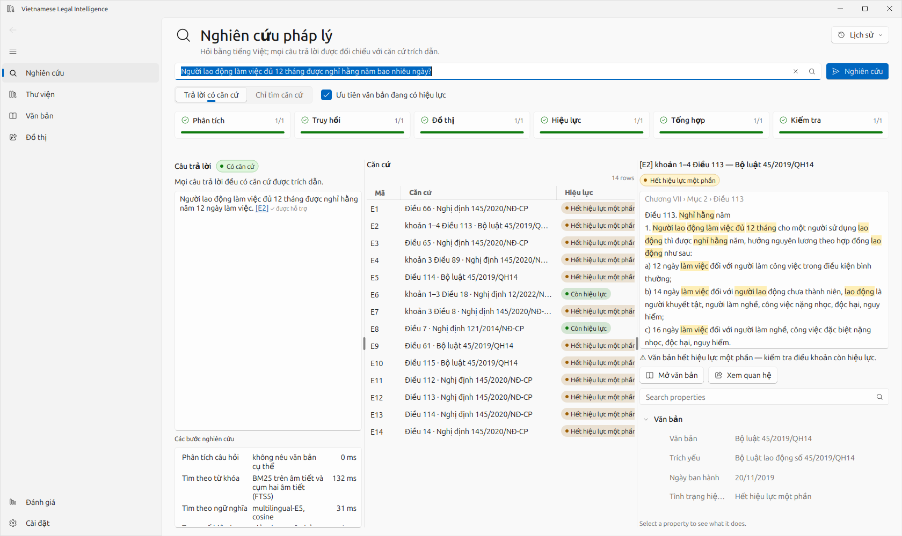
</picture>

## What it is

Vietnamese legal research is not keyword search: the answer to a question is an article, a clause or a point; it may
have been amended by a later law, detailed by a decree, or replaced altogether. This workstation turns the published
texts into that structure and keeps every link back to the words it came from.

| | |
|---|---|
| **Library** | 3,765 documents with full text (every law, code and ordinance; decrees in force; the documents of the evaluation set) and a catalogue of 171,556 documents. HTML, DOCX and text-layer PDF files can be imported too. |
| **Structure** | 100,071 articles with their clauses and points, chapters and sections, each traceable to its lines in the original. |
| **Knowledge graph** | 446,343 official relationships between documents in 13 directed kinds (amends, replaces, repeals, ends the effect of, guides, is based on…) and 120,304 provision-level citations and amendment instructions extracted from the text; projected into Neo4j. |
| **Research** | Hybrid retrieval (BM25 + multilingual-E5, rank fusion), validity weighting from the graph, expansion to amending and guiding provisions, answers from a local language model with every sentence checked against the evidence it cites. |
| **Runs** | On a laptop CPU, offline once the data is downloaded; the language model is local by default (Ollama), so questions and documents never leave the machine. |

## Research: from a question to the provision

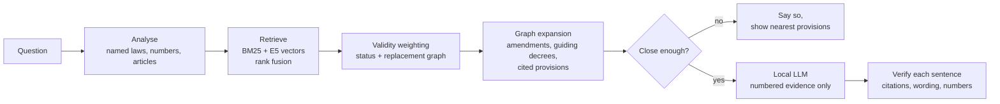

The steps are fixed and deterministic up to the language model, which only writes the final text from numbered
evidence. Every sentence of the answer is then checked: its citations must be items the model was given, its
content must be found in the cited text, and every number in it must appear there. The interface shows the steps,
their timings and the verification, and lets the reader move from answer → evidence → provision → source document.

**Validity from the graph.** The portal's effect-status field lags behind its own relationship records: a decree
replaced in 2021 can still be marked “in force”. The workstation trusts the relationships: a document replaced or
ended by a document already in effect is ranked lower and marked, with the replacing document named.

## Screens

| | |
|---|---|
| 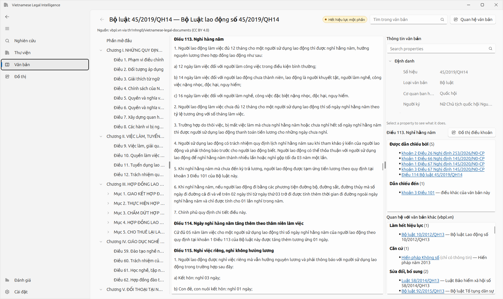 | 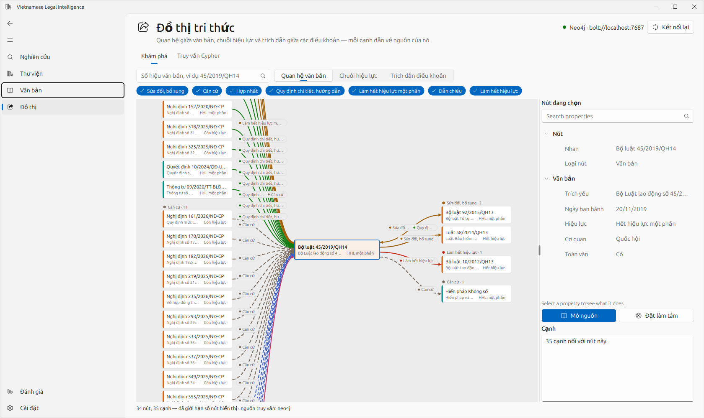 |
| **Document reader:** outline, original text, metadata, the citations into and out of the current article, and the official relations. | **Knowledge graph:** a code with what amends, guides and replaced it (relation kinds capped per direction so the informative ones stay visible). |
| 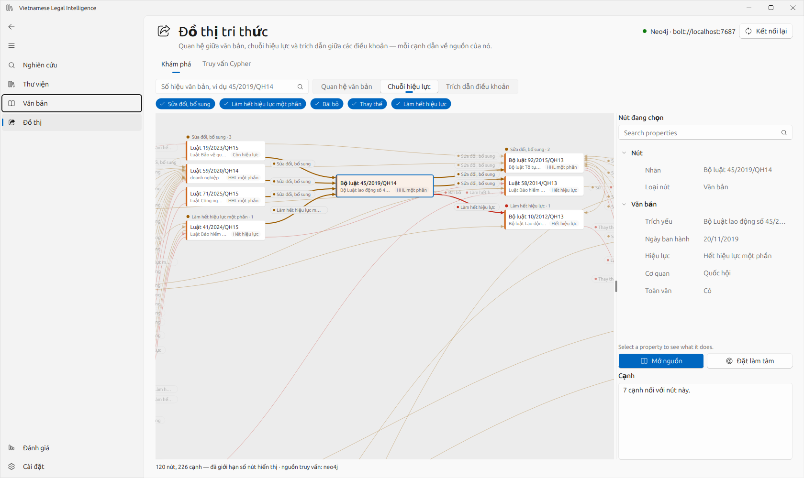 | 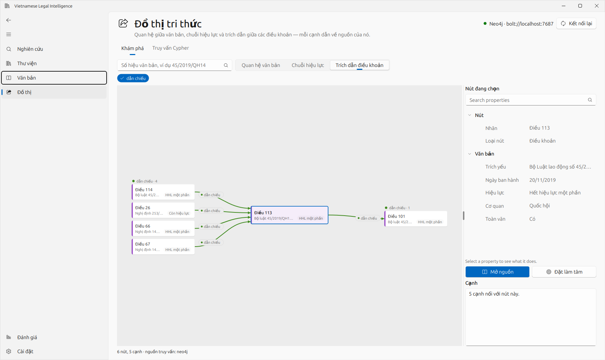 |
| **Validity lineage:** variable-length paths over amend, replace, repeal and terminate relations. | **Provision citations:** the articles that cite, amend or detail one article. |
| 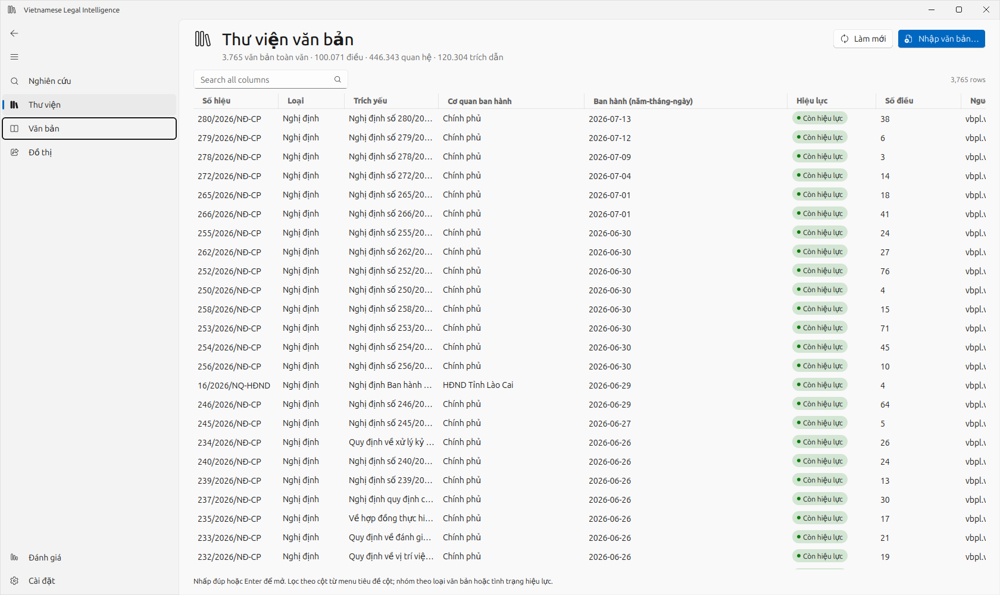 | 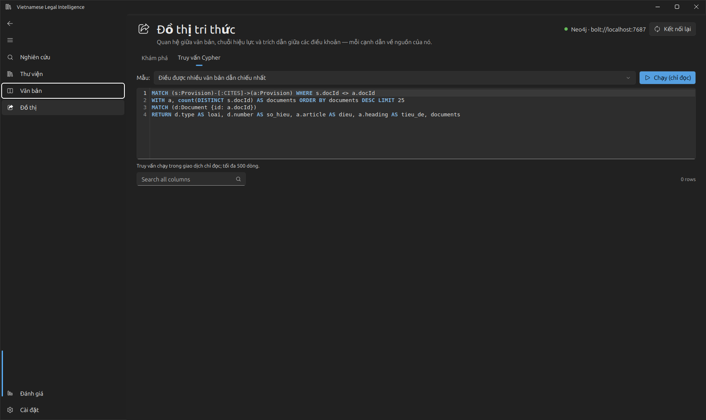 |
| **Library:** search, filters, grouping; import of HTML, DOCX and PDF. | **Read-only Cypher console** on the Neo4j projection, with example queries. |
| 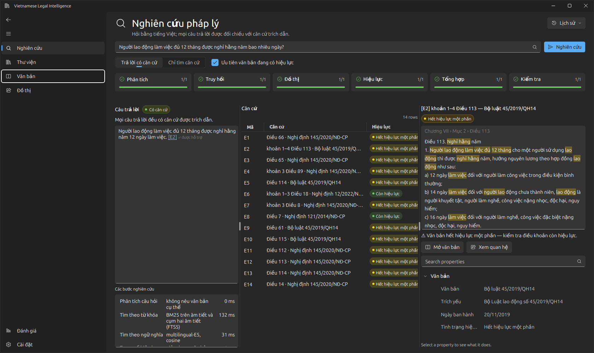 | 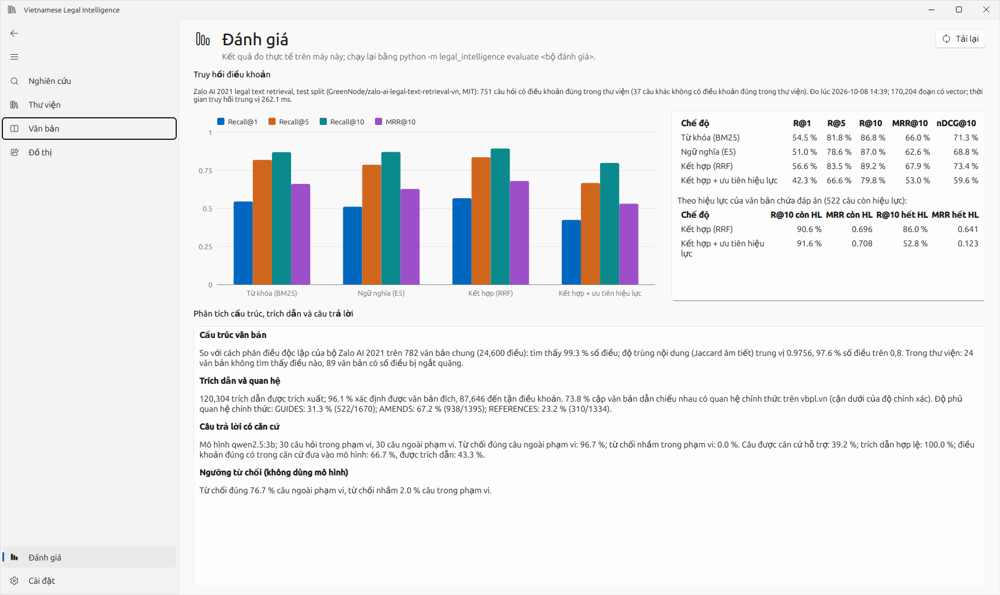 |
| **Dark theme.** | **Evaluation:** the measured reports, inside the application. |

## Architecture

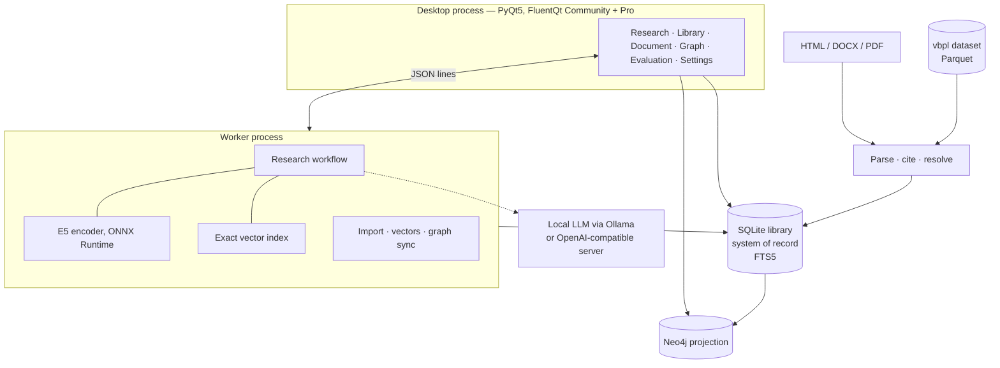

* **SQLite is the system of record** (documents, units, passages, relations, citations, research history, with
  provenance); **Neo4j is a projection** rebuilt from it in about 100 seconds. The application works without a Neo4j
  server, and a test checks that both answer the graph queries identically.
* **Structure parsing is deterministic.** Vietnamese drafting rules make it regular: parts, chapters, sections,
  articles (`Điều`), clauses (`1.`), points (`a)`), with quoted amending text, numbering checks and end matter handled
  explicitly. 3,811 documents parse in about 40 seconds.
* **Citations are resolved against the catalogue**: by number, by name and date, or by name at the citing document's
  date (“Bộ luật Lao động” in a 2016 decree means the 2012 code, in a 2021 decree the 2019 code), by the longest known
  name the phrase starts with.
* **Heavy work runs in a worker process** (ONNX Runtime, research, imports, vector builds, graph sync), with
  streaming, cancellation and resumable jobs; vectors are keyed by the text they encode, so re-importing a document
  only re-embeds what changed.

More: [docs/architecture.md](docs/architecture.md) · [docs/decisions.md](docs/decisions.md) ·
[docs/evaluation.md](docs/evaluation.md) · [docs/example.md](docs/example.md) (a real research run)

## Measured results

All measured on a laptop CPU (Intel i5-1235U, no GPU). Methods and full tables in
[docs/evaluation.md](docs/evaluation.md).

**Retrieval**, Zalo AI 2021 legal text retrieval test set (751 questions whose relevant article is in the library),
article level:

| Mode | Recall@1 | Recall@10 | MRR@10 |
|---|---|---|---|
| Keyword (BM25 on syllables and phrases) | 54.5 % | 86.8 % | 0.660 |
| Dense (multilingual-E5 small) | 51.0 % | 87.0 % | 0.626 |
| **Hybrid (rank fusion)** | **56.6 %** | **89.2 %** | **0.679** |

Validity weighting (the default, for research on current law), scored on the two groups of questions:

| Questions | Hybrid: Recall@10 / MRR@10 | Hybrid + validity weighting |
|---|---|---|
| Answer in a document in force today (522) | 90.6 % / 0.696 | **91.6 % / 0.708** |
| Answer (from 2021) in a document now expired or replaced (229) | 86.0 % / 0.641 | 52.8 % / 0.123 |

It helps on current law and, by design, ranks current provisions above historical answers; historical research
switches it off and gets the plain hybrid ranking.

**Structure**: 99.3 % of the 24,600 articles listed by an independent segmentation of the same 782 documents are
found, with a median text agreement of 0.976.

**Citations**: 120,304 extracted, 96.1 % resolved to a document; 73.8 % of the document pairs they link are also
related on the official portal (a lower bound on precision).

**Grounded answers** with a local 3B model (qwen2.5:3b, CPU) on 30 benchmark and 30 out-of-scope questions:
29 / 30 out-of-scope questions declined and none of the benchmark questions; every citation points to evidence the
model was given; 39 % of sentences pass the strict lexical support check and 5 / 30 answers contain a number not found
in the cited text. Those sentences are flagged in the interface, with the missing number named. A small local model
paraphrases and sometimes drifts; the verification layer is what makes that visible.

## Engineering decisions (and where they differ from the brief)

* **No agent loop.** With a small local model, a fixed, auditable workflow is more reliable than model-chosen tools,
  and the same question gives the same evidence. The graph, not the model, follows amendments and guidance.
* **Neo4j for exploration, SQLite for retrieval-time graph lookups**: identical results, 2.8 ms against 11.6 ms per
  expansion (medians), and no server needed to research.
* **No reranker yet**: the time budget went to validity weighting and graph expansion; reranking is the next
  experiment on the same benchmark.
* **Exact vector search**: ~170k × 384 vectors fit in memory and search in milliseconds; no vector database.
* **Dense model not trained on the benchmark**: Vietnamese legal embedding models fine-tuned on the Zalo data were
  avoided.

## Technology

Python 3.12 · PyQt5 · FluentQt Community (navigation, reader, settings, storage) · FluentQt Pro (`DataGrid`,
`PropertyInspector`, `PipelineView`, `ChartView`, `CodeEditor`, and `RelationGraphView`, a relationship-graph view
added to Pro for this application) · SQLite FTS5 · ONNX Runtime + multilingual-E5 · Neo4j 2026 Community + the
official Python driver · Ollama (qwen2.5 3B by default) or any OpenAI-compatible endpoint.

## Data and credits

* **Vietnamese Legal Documents**, Thịnh Ngô, Hugging Face, 2026, CC BY 4.0
  (huggingface.co/datasets/th1nhng0/vietnamese-legal-documents), compiled from vbpl.vn, the national legal document
  portal of the Ministry of Justice. Vietnamese legal documents are public.
* **Zalo AI 2021 Legal Text Retrieval** (GreenNode release, MIT), used only for evaluation.
* **intfloat/multilingual-e5-small** (MIT).

This is a research tool, not legal advice.
